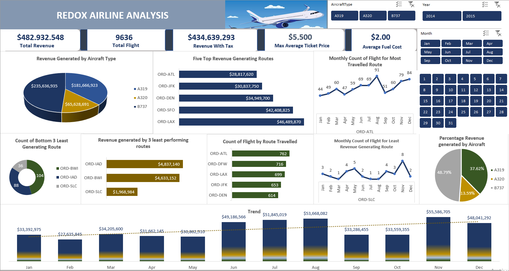

# Airline_Analysis

---

## Introduction
This is an Excel project on Airline Analysis of Redox Airline, a commercial startup airline operating out of Chicago, Illinois in the United States of America for the year 2014 and 2015. This project will analyze and derive insight into the operations of the company which will help the company make data driven decisions.

## Problem Statement
1.	What is the total revenue assuming a 10% tax on all fares?
2.	How many flights use the A319 Aircraft and what is the most common type of aircraft across all flights?
3.	Where are we the most profitable?
4.	Where are we losing the most money?
5.	How many flights are flown from O’Hare (ORD) to Los Angeles International Airport (LAX)?
6.	Which route account for the lowest percentage of revenue?
7.	What was the most popular month to fly?
8.	What is the maximum average ticket price for flights on the A320 aircraft?

## Skills/Concept Demonstrated
The following features in Excel were used:
- Power Pivot
- Data Analysis Expression (DAX)
- Data Modelling
- Power Query
- Pivot Chart
- Pivot Table
- Filters

## Modelling 
I downloaded the dataset from its source and imported it into Excel. The dataset was converted into a table from a range. The sheet contained four different tables: 
- Flight table which contained 9636 rows and 8 columns
- Aircraft table contained 211 rows and 4 columns
- Route table contained 24 rows and 5 columns
- Airport table contained 26 rows and 3 columns

I created a data model using Power Pivot which enabled me to create a relationship among all the tables in the sheet by joining the Primary Keys of each table to a secondary key on the fact table. This resulted into a star schema. There are 3 dimension tables and 1 fact table. 

## Data Transformation
After scrutinizing all the columns, they were found to be valid and devoid of empty cells and errors, therefore, I proceeded to create several measures and metrics in Power Query which helps in the result of our analysis. I used functions to extract the Year, Month and Day from the Flight Date column. Used DAX to calculate 10% Tax from the total fare and also the New Revenue after tax. Then I created pivot tables, adding KPIs that was used to analyze the dataset. Finally, I used Pivot charts and slicers to create an interactive dashboard which helped me to generate insight into the operation of the company.

## Visualization

## Insights
The following insights was drawn from the analysis:

- The total revenues for both years was $482,932,548 with a total flights of 9,636 on 24 routes. A tax of 10% was deducted from the revenue and the revenue after tax equates a total of $434,639,293. The year 2015 recorded a slight increase in revenue compared to the previous year with a percentage increase of 2.86% only.
- The Airline operates 3 types of Aircraft: The A319, the A320 and the B737. The most common/most flown aircraft across all route is the B737 aircraft accounting for the highest revenue generated by aircraft with a percentage of 48.79% and a total flight count of 4459 out of the total 9636 flights flown by the airline. It was followed by the B320 aircraft which generated a total of 37.62% of the total revenue. The B20 aircraft was flown least frequently and accounted for the least revenue generated (13.59%) with a total flight of 1298.
- The most travelled route is the Chicago O'Hare International(ORD) - Hartsfield-Jackson Atlanta International(ATL) route with a total flight of 762 and a total revenue of $28,817,620 which accounted for the fifth largest generating route by the company.
- The Chicago O'Hare International(ORD) - Los Angeles International(LAX)route was travelled a total of 699 times but generated the highest revenue of $46,488,870. The top five revenue generating routes are Chicago O'Hare International(ORD)-Los Angeles International(LAX), Chicago O'Hare International(ORD) - San Francisco International(SFO), Chicago O'Hare International(ORD) - Denver International (DEN), Chicago O'Hare International(ORD) - John F Kennedy International(JFK) and Chicago O'Hare International(ORD) - Hartsfield-Jackson Atlanta International (ATL) respectively.
- Also, the five most travelled routes are the Chicago O'Hare International(ORD) - Hartsfield-Jackson Atlanta International (ATL), Chicago O'Hare International(ORD) - Dallas/Fort Worth International (DFW), Chicago O'Hare International(ORD) - Los Angeles International (LAX), Chicago O'Hare International(ORD) - John F Kennedy International(JFK) and Chicago O'Hare International(ORD) -Denver International (DEN) respectively.
- Similarly, the Chicago O'Hare International(ORD) - Salt Lake City International (SLC) route accounted for the least route travelled by all three aircraft with only 36 flights flown in both years and a total revenue of $1,968,984(17.21%). Followed by the Chicago O'Hare International(ORD) - Baltimore/Washington International Thurgood Marshall (BWI) route with 88 flights and a revenue of $4,633,152 (40.50%).
- The most popular months to fly are June, July and August but despite these three being the most flown routes, November recorded the highest revenue for both years.
- The least maximum average ticket price $563 was flown by Aircraft A320 in the year 2014 across only 686 flights.

## Recommendation
Based on the analysis, it is recommended to: 
- Make a comprehensive review of the least flown routes Chicago O'Hare International(ORD) - Salt Lake City International (SLC), Chicago O'Hare International(ORD) - Baltimore/Washington International Thurgood Marshall (BWI) and Chicago O'Hare International(ORD) - Washington Dulles International (IAD). What are the reasons for less patronage and alos explore what possible ways to encourage customers to fly. 
- Offering attractive packages and tailored marketing campaigns can attract more passengers and give a considerable boost to performance but if the operational costs exceeds the revenue generated after a thorough review, then the flights on these route may be discontinued. Those aircraft can then be used to provide more services for route with popular demands such as the Chicago O'Hare International(ORD) - Hartsfield-Jackson Atlanta International(ATL) route which accounted for the most route travelled but with the fifth largest generating revenue. This route has great potential to generate more revenue if proper attention is given to it. With more aircraft available for this route and others like it, revenue will soar greatly as there will be enough flights to cover demands especially in peak seasons as the wait time will decrease significantly.
